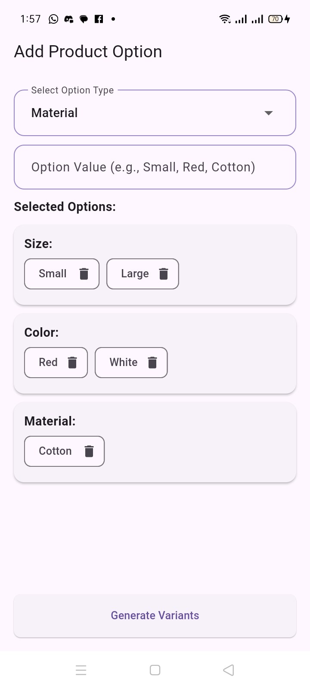
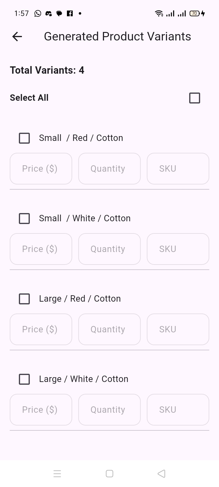
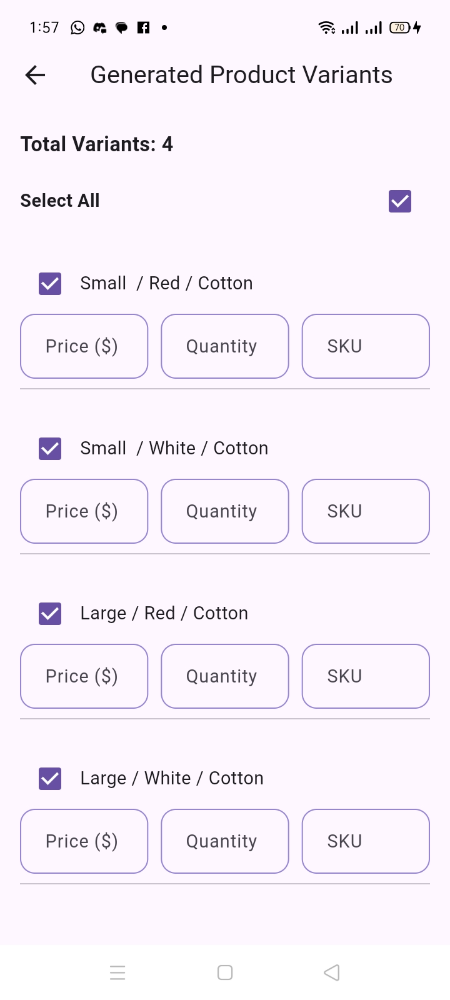

# Product Variants App

This Flutter application allows users to create product variants based on various
product options such as size, color, and material. It provides an easy-to-use
interface to add product options, generate product variants, and manage selections 
with additional functionalities like bulk select/deselect of variants.

# Features
Add Product Options: Users can select an option type (e.g., Size, Color, Material) 
and input the values for each type (e.g., Small, Red, Cotton).
Edit Product Options: Users can edit or delete previously added option values.
Generate Variants: Based on the selected options, the app generates all possible
combinations of product variants.
Select/Deselect Variants: Users can individually select or deselect product
variants or select/deselect all at once using a bulk selection option.

# Screenshots
### Add Product Option Screen

### Generated Product Variants Screen

# Getting Started
# Prerequisites
Flutter SDK installed (version 2.x or higher).
A text editor or IDE of your choice (VS Code, Android Studio, etc.).
A connected device or emulator to run the app.

# Installing
Clone the Repository:
git clone https://github.com/Leah-Tugi/Product-Variants-App.git

Navigate to the Project Directory:
cd product-variants-app

Install Dependencies:
flutter pub get

Run the App:
flutter run

Folder Structure
product-variants-app/
│
├── lib/
│   ├── main.dart                # Entry point of the app
│   ├── screens/
│   │   ├── product_option_screen.dart   # Screen for adding product options
│   │   └── product_variant_screen.dart  # Screen for generating and displaying product variants
│   ├── widgets/
│   │   └── variant_row.dart      # Custom widget for displaying a single product variant row
│   └── models/
│       └── product_variant.dart  # (Optional) Model for managing product variant data
├── pubspec.yaml                  # Dependency manager file
└── README.md                     # Project readme file

# How to Use
Add Product Options:

Navigate to the "Add Product Option" screen.
Choose an option type (e.g., Size, Color, Material) from the dropdown.
Enter a value for the selected option (e.g., Small for Size or Red for Color) and press enter to add it.
Edit or Delete Options:

After adding an option, click on the option chip to edit the value.
To delete a value, click on the delete icon inside the chip.
Generate Product Variants:

After adding all required options, click on the "Generate Variants" button.
The app will display all possible combinations of the options as product variants.
Select/Deselect Variants:

You can individually select or deselect variants using the checkboxes next to each variant.
Use the "Select All" checkbox at the top to select or deselect all variants at once.
Dependencies
This app uses the following Flutter packages:

flutter/material.dart: Standard Flutter material design components for UI elements.

# Contributing
Contributions are welcome! Please follow these steps to contribute:

# Fork the repository.
Create a new feature branch (git checkout -b feature-branch-name).
Make your changes and commit (git commit -m 'Add feature').
Push to the branch (git push origin feature-branch-name).
Create a pull request.

### Contact
If you have any questions or suggestions, feel free to reach out:

GitHub: Leah-Tugi
Email: [leahtugi1999@gmail.com]

# License
This project is licensed under the MIT License - see the LICENSE file for details.